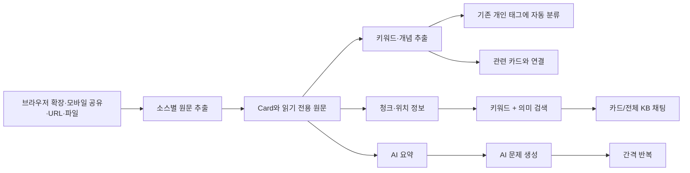

# Recall 레퍼런스 분석과 Nuff 설계안

조사일: 2026-09-24

## 1. 먼저 알아야 할 한계

Recall(recall.it)의 서버 코드, 실제 데이터베이스 스키마, 프롬프트, 임베딩 모델, 검색 가중치, 태그 생성 기준은 공개되어 있지 않다. Recall도 요약에 “fine-tuned models and proprietary methods”를 사용한다고만 밝힌다. 따라서 이 문서는 다음을 분리한다.

- **확인됨**: Recall 공식 문서, API 응답 구조, 제품 설명에서 직접 확인되는 사실
- **강한 추론**: 공개 API와 동작을 만족하려면 내부에 존재할 가능성이 높은 구조
- **Nuff 제안**: 공개 기술로 같은 효용을 더 단순하고 저렴하게 구현하는 방법

Recall을 그대로 복제하는 것이 목표가 아니다. 가장 재사용할 가치가 큰 원칙은 **원문을 보존하고, AI 결과를 파생 데이터로 만들며, 저장 시 한 번 구조화한 결과를 검색·연결·재노출에 반복 사용한다**는 점이다.

## 2. Recall이 실제로 하는 일

Recall의 기본 단위는 `Card`다. 기사, 영상, 팟캐스트, PDF, 메모 하나가 카드 하나가 된다. 카드 안에는 서로 성격이 다른 세 영역이 있다.

1. **Reader**: 저장 시점의 원문을 읽기 전용으로 보존한다.
2. **Notebook**: 자동 요약, 사용자 메모, 다른 카드 링크를 편집 가능한 형태로 저장한다.
3. **Chat**: 해당 카드 또는 전체 지식베이스에서 근거 청크를 찾아 답한다.

공식 API는 카드 목록과 카드별 `chunks`를 노출한다. 각 청크는 `chunk_id`, `content`, 선택적 `source`(예: PDF page 3), `timestamps`(예: 영상 01:23)를 가진다. 검색 API는 “semantic search”를 제공하고, MCP 문서는 이를 **semantic + keyword matching**이라고 더 구체적으로 설명한다. 필터는 태그, 저장 날짜, 원본 URL을 지원한다.

Recall이 공개적으로 설명하는 저장 후 처리는 다음 순서다.



지원 소스는 일반 웹, YouTube/Shorts, TikTok, Vimeo, Apple·Spotify 팟캐스트, PDF, Google Docs/Slides, 텍스트·Markdown, X, Reddit, LinkedIn, Instagram, Facebook이다. 로그인·유료·비공개 콘텐츠는 URL만으로 안정적으로 읽을 수 없으므로 브라우저 확장을 권장한다. 이 점은 Nuff에도 중요하다. 서버 크롤러 하나로 모든 소스를 처리하려는 설계는 실패한다.

### 확인된 것과 공개되지 않은 것

| 항목 | 상태 | 공개 근거 또는 해석 |
|---|---|---|
| Card가 저장 콘텐츠의 기본 단위 | 확인됨 | 공식 제품·API 문서 |
| 원문과 편집 가능한 메모를 분리 | 확인됨 | Reader / Notebook 문서 |
| card 내부를 위치 정보가 있는 chunk로 조회 | 확인됨 | REST API 응답 |
| graph database 사용 | 확인됨 | 공식 소개 문서 |
| 키워드 + 의미 검색 결합 | 확인됨 | MCP 문서 |
| 개인의 기존 태그에 맞춘 자동 태깅 | 확인됨 | FAQ·Tagging 문서 |
| 개념 추출과 수동 링크로 카드 연결 | 확인됨 | Graph 문서 |
| 로컬 우선 DB와 벨기에 GCP 동기화 | 확인됨 | FAQ |
| 실제 DB 제품, 테이블, 동기화 프로토콜 | 비공개 | 제품 동작만 공개 |
| 임베딩·요약 모델과 프롬프트 | 비공개 | 작업별 모델 라우팅만 공개 |
| 청킹 길이와 검색·그래프 가중치 | 비공개 | API의 chunk 형태만 공개 |
| 태그·entity normalization 임계값 | 비공개 | 결과 동작만 공개 |

따라서 이후 알고리즘 설명은 Recall의 비공개 코드를 추측해 단정하는 내용이 아니라, 같은 공개 동작을 구현할 수 있는 Nuff용 설계다.

## 3. 공개 정보로 복원한 논리 데이터 구조

아래 구조는 Recall의 실제 테이블명이 아니다. 제품 동작과 공개 API를 만족하는 최소 논리 모델이다.

```mermaid
erDiagram
    USER ||--o{ IDENTITY : owns
    USER ||--o{ POCKET : owns
    USER ||--o{ CONTENT_ITEM : saves
    CONTENT_ITEM ||--o{ SOURCE_SNAPSHOT : preserves
    CONTENT_ITEM ||--o{ CHUNK : splits
    CONTENT_ITEM ||--o{ ARTIFACT : derives
    CONTENT_ITEM ||--o{ ITEM_TAG : classified_as
    TAG ||--o{ ITEM_TAG : labels
    CONTENT_ITEM ||--o{ MENTION : contains
    CONCEPT ||--o{ MENTION : appears_as
    CONTENT_ITEM ||--o{ CONNECTION : from
    CONTENT_ITEM ||--o{ CONNECTION : to
    CONTENT_ITEM ||--o{ POCKET_ITEM : grouped_in
    POCKET ||--o{ POCKET_ITEM : contains
    CONTENT_ITEM ||--o{ USER_EVENT : receives
    CONTENT_ITEM ||--o{ REVIEW_QUESTION : generates
    REVIEW_QUESTION ||--|| REVIEW_STATE : scheduled_by
```

### 핵심 엔터티

| 엔터티 | 저장할 내용 | 이유 |
|---|---|---|
| `identity` | `user_id`, `provider`, `provider_user_id` | 카카오, 웹, 향후 DM 계정을 한 사용자로 연결 |
| `capture` | 수신 채널, 원문 payload, 수신 시각, idempotency key | 파싱 실패 시 재처리하고 채널별 문제를 추적 |
| `content_item` | canonical URL, source type, 제목, 작성자, 게시일, 처리 상태 | 모든 소스를 하나의 공통 단위로 표현 |
| `source_snapshot` | 원 HTML/텍스트/자막/OCR, 추출기 버전, checksum | AI 결과가 틀려도 원문을 잃지 않고 재처리 |
| `chunk` | 순서, 텍스트, page/time/DOM 위치, embedding | 검색 결과를 정확한 근거 위치로 연결 |
| `artifact` | summary/claims/actions 등, model/prompt/schema version | AI 출력의 재생성·비교·비용 추적 |
| `claim` | 주장 텍스트, source chunk, confidence | Nuff의 반복·새로움 계산을 키워드보다 정확하게 수행 |
| `concept` / `mention` | 정규화 개념, 원문 표기, 위치 | 카드 연결과 탐색 그래프 구성 |
| `tag` / `item_tag` | 계층, 출처(auto/user), confidence | 개인화된 분류 체계 유지 |
| `pocket` / `pocket_item` | 목적, 상태, 사용자 우선순위 | Nuff의 작업 주머니·전공 지식 주머니 구현 |
| `connection` | source/target, 종류, 점수, 근거 | 수동 링크, 공통 개념, 의미 유사성을 구분 |
| `user_event` | open, read, dismiss, act, share, pin | 재노출 순위와 제품 가치 측정 |
| `processing_job` | 단계, 시도 횟수, lease, 오류, 비용 | 비동기 파이프라인의 재시도·관찰 가능성 |

### 절대 합치면 안 되는 세 데이터

- 원문 스냅샷: 수정 불가
- AI 파생 결과: 버전과 생성 근거를 보존하며 재생성 가능
- 사용자 메모·우선순위: 사용자의 의도를 나타내며 AI 재처리로 덮어쓰면 안 됨

Recall의 Reader와 Notebook 분리는 이 원칙을 제품 수준에서 보여준다.

## 4. 단계별 알고리즘

### 4.1 수집과 중복 제거

수신 즉시 AI를 호출하지 않는다. 먼저 `capture`와 작업을 내구성 있게 저장하고 짧은 성공 응답을 보낸다. 현재 Nuff의 카카오 작업 큐, lease, 재시도 방식은 방향이 맞다.

중복은 세 단계로 판정한다.

1. **정확 중복**: 추적 파라미터를 제거한 canonical URL이 동일
2. **내용 중복**: 정제 원문의 SHA-256이 동일
3. **근접 중복**: 제목 + 핵심 청크 임베딩 유사도가 매우 높고 게시 시점·도메인이 가까움

정확 중복은 자동 병합한다. 근접 중복은 동일 콘텐츠의 재게시일 수 있으므로 `duplicate_group`으로 묶되 원문은 보존한다.

### 4.2 소스 라우팅과 추출

하나의 범용 정규식 추출기로 모든 URL을 읽지 않는다.

| 소스 | 1차 추출 | 실패 시 |
|---|---|---|
| 일반 기사·블로그 | Mozilla Readability + JSON-LD/OpenGraph | 브라우저 확장에서 DOM 전달 |
| YouTube/Shorts | 공식 메타데이터 + 제공 자막 | 사용 허용 범위 내 ASR |
| Instagram/TikTok | 공유 URL 메타데이터·캡션 | 앱/확장 캡처, 사용자가 붙여넣은 텍스트 |
| PDF | 텍스트 레이어 + 페이지 좌표 | OCR |
| 이미지 | OCR + 이미지 설명 | 사용자 보충 설명 |
| 팟캐스트 | RSS 메타데이터·공개 transcript | ASR 또는 처리 불가 상태 |

추출 결과는 공통 `SourceDocument`로 정규화한다.

```ts
type SourceDocument = {
  sourceType: 'web' | 'video' | 'social' | 'pdf' | 'image' | 'audio' | 'note'
  title: string
  author?: string
  publishedAt?: string
  canonicalUrl?: string
  blocks: Array<{
    kind: 'heading' | 'paragraph' | 'caption' | 'transcript' | 'ocr'
    text: string
    page?: number
    startSec?: number
    endSec?: number
    locator?: string
  }>
}
```

“영상, 사진, 글에서 일관된 output”은 모든 원문을 똑같은 텍스트로 뭉개는 것이 아니다. 공통 구조를 쓰되 원본 위치(page/time/locator)를 함께 보존하는 것이다.

### 4.3 청킹

청크는 고정 글자 수만으로 자르지 않는다.

- 기사: 제목/소제목 경계를 우선하고 400~800 token 목표, 10~15% overlap
- 자막: 30~90초 구간과 문장 경계를 함께 사용
- PDF: 페이지와 소제목을 유지하되 표·각주는 별도 block
- 짧은 소셜: 게시물 하나를 한 청크로 두고 댓글은 별도 청크

각 청크에 `item_id`, `ordinal`, `text`, `token_count`, `locator`, `embedding_model`, `embedding`을 저장한다. 모델을 바꿀 때 기존 벡터와 섞이지 않도록 임베딩 모델 버전이 필요하다.

### 4.4 한 번의 구조화 호출

저장 시 작은 모델에 JSON schema를 강제해 다음을 한 번에 생성한다.

- 한 문장 요약
- 핵심 주장 1~5개와 각 주장의 근거 청크
- 키워드/개념
- 실행 가능한 항목
- 콘텐츠 성격: `must_consume | action | inspiration | reference`
- 예상 읽기/시청 시간
- 신뢰도와 불확실성

상세 요약, 퀴즈, 전체 KB 답변은 사용자 요청 시 생성한다. 모든 저장 건에 비싼 모델로 긴 요약을 만들 이유가 없다. Recall도 요금제에서 작업에 따라 frontier/open-source/Gemini Flash를 자동 선택한다고 밝힌다. Nuff는 더 단순하게 `저가 모델 기본 → 품질 실패/사용자 요청 시 상위 모델` 라우팅으로 시작할 수 있다.

### 4.5 개인화 태그

Recall의 중요한 특징은 전 세계 공통 분류표가 아니라 **그 사용자가 이미 쓰는 태그에 맞춘다**는 점이다.

Nuff 알고리즘:

1. 새 콘텐츠 임베딩으로 기존 태그 설명/대표 콘텐츠 중 상위 10개 후보를 찾는다.
2. 제목·주장·후보 태그만 작은 모델에 보내 최대 3개를 고르게 한다.
3. 최고 점수가 기준 이하일 때만 새 태그를 제안한다.
4. 사용자의 수정은 학습 이벤트로 저장한다.

초기 사용자는 태그 데이터가 없으므로 넓은 기본 주머니 몇 개를 사용한다. 저장량이 늘면 사용자의 수정 기록으로 후보 점수와 임계값을 조정한다. 이 방식은 매번 전체 태그 목록을 LLM에 보내는 것보다 싸고 일관적이다.

### 4.6 연결과 지식 그래프

Recall은 연결의 출처를 세 가지로 공개한다: 사용자가 만든 `[[link]]`, AI가 추출한 개념, 한 콘텐츠가 다른 콘텐츠를 직접 참조한 링크다. 카드가 노드이고 연결이 edge이며, 연결이 많은 노드를 크게 표시한다.

Nuff는 다음 edge를 분리한다.

- `manual`: 사용자가 직접 연결
- `citation`: 원문 링크·인용
- `shared_concept`: 정규화된 개념 공유
- `semantic`: 콘텐츠 임베딩 유사
- `supports` / `contradicts`: 주장 단위 관계, 후순위 기능
- `same_pocket`: 같은 목적의 주머니

MVP에서 그래프 화면을 먼저 만들 필요는 없다. edge를 저장하면 “이 정보와 연결된 3개”, “반복해서 나온 주장”, “서로 충돌하는 관점” 같은 실용 화면부터 만들 수 있다. 그래프 UI는 데이터가 충분히 쌓인 뒤에 붙여도 된다.

### 4.7 검색과 RAG

Recall MCP 문서가 검색을 semantic + keyword 조합이라고 명시하므로, Nuff도 hybrid retrieval이 적합하다.

1. BM25/FTS로 정확한 용어, 인물명, 제품명을 찾는다.
2. 벡터 검색으로 표현이 다른 같은 의미를 찾는다.
3. Reciprocal Rank Fusion(RRF)으로 두 순위를 결합한다.
4. 사용자·주머니·날짜·소스 필터를 적용한다.
5. 상위 청크와 위치 정보를 LLM에 제공하고 답변에 원문 링크·페이지·타임스탬프를 붙인다.

초기 데이터가 수천 건 이하라면 별도 그래프 DB나 검색 클러스터가 필요 없다. PostgreSQL + full-text search + pgvector 하나로 충분하다. 현재 Cloudflare D1을 수집 큐와 MVP 데이터에 계속 쓰고, 의미 검색이 실제 사용자 가치로 확인된 뒤 벡터 저장소를 추가하는 편이 안전하다.

### 4.8 ‘새로움’과 반복 신호

현재 Nuff는 키워드 중복률로 Enough Signal을 계산한다. 이는 동의어를 놓치고, 같은 키워드의 반대 주장도 반복으로 오인한다. 다음처럼 주장 단위로 바꾼다.

새 콘텐츠의 주장 `c`에 대해 같은 주머니의 과거 주장과 최대 유사도를 구한다.

```text
redundancy(c) = max cosine(embed(c), embed(old_claim))
novelty(c)    = 1 - redundancy(c)
```

콘텐츠 수준 점수:

```text
novelty(item) = median(top_claim_novelty)
coverage(pocket) = 반복 확인된 핵심 주장 수 / 현재 핵심 주장 수
```

단, 코사인 유사도만으로 찬반을 구분할 수 없다. 유사도가 높은 후보에 한해서 작은 NLI/LLM 판정을 사용해 `same`, `supports`, `contradicts`, `unrelated`로 분류하고 결과를 캐시한다.

`Enough Signal`은 “이 주제의 모든 것을 안다”는 판정이 아니다. 다음처럼 사용자에게 좁게 표현한다.

- 최근 저장물의 70% 이상이 기존 핵심 주장과 겹침
- 새롭게 추가된 주장이 2개 미만
- 서로 다른 출처가 핵심 주장 대부분을 2회 이상 뒷받침

표시 문구도 “충분히 알았습니다”보다 “최근 자료에서 새 정보가 적어졌어요”가 정확하다.

### 4.9 재노출 순위

외부 콘텐츠 추천 엔진을 만들 필요가 없다. 사용자가 저장한 항목 중 지금 가치가 높은 것을 순위화한다.

```text
score =
  0.30 * explicit_priority
+ 0.20 * actionability
+ 0.15 * pocket_relevance
+ 0.15 * novelty
+ 0.10 * due_for_review
+ 0.10 * freshness
- 0.20 * already_consumed
- 0.15 * recently_shown
```

초기 가중치는 규칙으로 시작한다. `open`, `complete`, `dismiss`, `act` 이벤트가 쌓이면 pairwise ranking이나 contextual bandit을 검토한다. 처음부터 추천 모델을 학습하면 데이터가 부족해 설명하기 어렵고 개선 여부도 측정하기 힘들다.

### 4.10 간격 반복

Recall이 공개한 현재 방식은 5단계 규칙이다.

- New: 즉시
- Learning: 오답 후 약 1일
- Practiced: 1~2회 연속 정답, 3~7일
- Confident: 3~4회 연속 정답, 14일~1개월
- Mastered: 5회 이상 연속 정답, 약 3개월
- Mastered에서도 틀리면 Learning으로 복귀

Nuff MVP에는 이 규칙이면 충분하다. 학습 기능이 핵심 가치로 확인되면, 회상 확률·난이도·기억 안정성을 모델링하는 공개 FSRS 구현으로 교체할 수 있다.

## 5. 비용을 낮추는 구조

비용을 결정하는 것은 저장 건수보다 “같은 원문을 몇 번 다시 모델에 보내는가”다.

1. URL 정규화·내용 hash로 중복 호출을 막는다.
2. 원문 추출과 청킹은 코드로 처리한다.
3. 임베딩은 청크당 한 번 만들고 모델 버전별로 캐시한다.
4. 기본 구조화는 작은 모델 한 번으로 끝낸다.
5. 긴 영상은 먼저 구간별 압축 후 최종 요약을 만든다.
6. 상세 요약·퀴즈·모순 분석은 사용자가 실제로 요청할 때 실행한다.
7. 피드 순위와 Enough Signal은 저장된 feature로 계산한다. 매 화면 로드마다 LLM을 호출하지 않는다.
8. 주머니 요약은 새 항목이 들어왔을 때 증분 갱신하고, 이전 요약 버전을 보존한다.
9. 모델, 입력/출력 token, latency, 실패 원인을 `artifact`와 작업 로그에 기록한다.

목표 비용은 “월 API 비용”만 보지 말고 `성공적으로 추출된 항목 1개당 비용`, `사용자가 다시 연 항목 1개당 비용`, `행동으로 이어진 항목 1개당 비용`으로 본다.

## 6. 현재 Nuff 코드에서 바꿀 순서

현재 장점:

- 카카오 수신과 분석 작업이 분리되어 있다.
- D1에 작업을 먼저 저장하고 lease, 재시도, idempotency를 처리한다.
- `AIProvider`가 교체 가능하고 JSON schema를 강제한다.
- 사용자별 저장, 중복 URL, 실패 상태가 이미 있다.

현재 가장 큰 구조적 한계는 `contents.data` JSON 하나에 원문 메타데이터와 AI 결과가 섞이고, 실제 원문·청크·모델 버전이 남지 않는다는 점이다. 다음 순서로 확장한다.

### 단계 A — 파이프라인 품질부터 측정

- `captures`, `source_snapshots`, `processing_runs` 추가
- 소스 유형, 추출 방식, 글자 수, 실패 코드, 처리 시간, AI 비용 기록
- 일반 웹 30, YouTube 20, Instagram 20, PDF 15, 기타 15개로 100개 평가셋 작성
- 지표: 수신 성공률, 본문 확보율, 근거 위치 보존율, p50/p95 처리시간, 항목당 비용

### 단계 B — 공통 콘텐츠 모델

- `contents.data`에서 제목·상태·source type을 컬럼으로 분리
- 원문과 AI 결과를 각각 `source_snapshots`, `artifacts`로 이동
- `claims`, `chunks`, `tags`, `content_tags` 추가
- 기존 JSON은 마이그레이션 기간 동안 읽기 호환용으로 유지

### 단계 C — Nuff만의 핵심 가치

- 저장 시 `must_consume/action/inspiration/reference`를 한 번 물어보거나 빠른 버튼으로 받기
- `pockets`, `pocket_items` 추가
- 주장 임베딩 기반 새로움·반복 신호
- “오늘 볼 것 3개”, “이번 주 실행할 것”, “최근에는 새 정보가 적은 주머니” 제공

### 단계 D — 검색과 연결

- 청크 hybrid search
- 관련 항목 3개와 정확한 근거 위치 노출
- 주머니 단위 질문·답변
- 충분한 edge가 쌓인 뒤 그래프 시각화

### 단계 E — 소스 확장

- 모바일 share extension 또는 PWA share target
- 브라우저 확장으로 로그인·paywall 페이지 DOM 캡처
- YouTube transcript, PDF, OCR 순으로 어댑터 추가
- Instagram은 약관과 접근 제한을 고려해 링크·캡션·사용자 제공 텍스트부터 검증

## 7. 무엇을 가져오고 무엇을 다르게 할지

### Recall에서 가져올 것

- 원문 Reader와 사용자 Notebook의 분리
- Card/Chunk/Locator 구조
- 기존 개인 태그에 맞춘 자동 분류
- 키워드와 의미 검색의 결합
- 개념을 매개로 한 연결
- 저장할 때 구조화하고 이후 여러 기능에서 재사용
- 소스별 수집 어댑터와 브라우저 확장

### Nuff가 다르게 가져갈 것

- 저장 순간에 사용자의 **의도와 우선순위**를 확보
- 그래프 자체보다 **주머니의 결과물**을 먼저 제공
- 키워드 빈도보다 **주장 단위 새로움·반복·충돌**을 계산
- “보관했다”에서 끝내지 않고 읽기·실행·폐기 중 하나로 이동
- 카카오/DM 같은 대화형 inbox를 1급 수집 채널로 취급

Nuff의 좋은 한 문장 정의는 다음과 같다.

> 어디서 발견했든 한 곳으로 보내면, Nuff가 원문을 구조화하고 사용자의 목적별 주머니에 넣어 지금 봐야 할 것, 반복되는 것, 실행할 것을 보여준다.

## 8. 구현 결론

가장 먼저 만들 것은 화려한 추천 모델이나 지식 그래프 화면이 아니다.

1. 카카오에서 링크를 확실히 받는다.
2. 서로 다른 소스를 `SourceDocument` 하나로 정규화한다.
3. 원문·청크·AI 산출물·사용자 의도를 분리해 저장한다.
4. 주장 단위 새로움과 간단한 재노출 점수를 계산한다.
5. 실제 사용자가 저장한 100건으로 품질과 비용을 측정한다.

이 다섯 단계가 안정되면 채팅, 그래프, 퀴즈는 같은 데이터 위에 비교적 쉽게 추가할 수 있다. 반대로 이 토대 없이 기능부터 늘리면 모든 화면이 불완전한 추출 결과와 중복 AI 호출에 묶인다.

## 9. 근거 자료

- [Recall FAQ: 저장, 개인정보, 모델 선택, 주요 기능](https://www.recall.it/faq)
- [Recall 공식 소개: 저장 후 요약·개념·태그·연결 처리](https://www.recall.it/about)
- [Recall Cards: Reader, Chat, Notebook](https://docs.recall.it/getting-started/3-summarize-and-chat-with-content)
- [지원 콘텐츠와 소스별 제약](https://docs.recall.it/supported-content/all-supported-content)
- [Knowledge Graph의 노드·연결 출처](https://docs.recall.it/deep-dives/graph/overview)
- [개인화·계층형 태그](https://docs.recall.it/deep-dives/tagging)
- [Augmented Browsing의 로컬 키워드 모델](https://docs.recall.it/deep-dives/recall-augmented-browsing)
- [Recall REST API의 Card/Chunk/Search 구조](https://docs.recall.it/developer/api)
- [Recall MCP의 hybrid search와 metadata filters](https://docs.recall.it/developer/mcp)
- [Recall Quiz와 공개된 5단계 복습 간격](https://docs.recall.it/deep-dives/quiz-and-spaced-repetition)
- [Mozilla Readability](https://github.com/mozilla/readability)
- [pgvector: vector·full-text hybrid search와 RRF](https://github.com/pgvector/pgvector)
- [Open Spaced Repetition: FSRS 알고리즘](https://github.com/open-spaced-repetition/awesome-fsrs/wiki/The-Algorithm)
