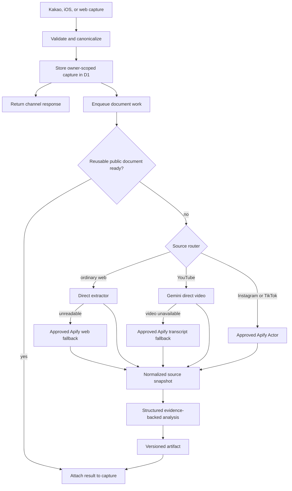

# Plan: Multi-source public-link ingestion

Status: approved structure; provider choices pending benchmark  
Specification: `spec.md`  
Execution checklist: `tasks.md`

## Delivery cadence

Implementation is delivered through the 12-stage roadmap in `tasks.md`. Each stage is a reviewable checkpoint that must leave the existing capture paths usable and the repository in a tested, commit-ready state. The roadmap is the user-facing progress view; the task IDs remain the technical source of truth.

Estimates in the roadmap are active implementation time, not calendar promises. Provider reruns on a different day, production canaries, external console changes, and real-device checks may add elapsed time without adding equivalent coding time.

When a request authorizes work across multiple stages, continue automatically after announcing each transition. Stop only at the explicit external boundaries defined in `AGENTS.md`.

## Implementation principles

1. Preserve the current durable-before-acknowledgement behavior.
2. Prefer the cheapest safe extractor that can satisfy the source contract.
3. Keep provider-specific schemas inside adapters.
4. Reuse only public, provenance-bearing source results.
5. Store immutable source snapshots and versioned AI artifacts.
6. Make retries idempotent and fence stale workers and duplicate webhooks.
7. Add infrastructure only when its acceptance gate is verified.

## Current baseline

- `ingestion/kakao.ts` and `ingestion/shortcut.ts` normalize and store URLs in `capture_jobs` before responding.
- `ingestion/worker.ts` runs a scheduled drain once per minute.
- `ingestion/processor.ts` claims at most four jobs per tick using a lease token.
- `lib/pipeline.ts` combines source routing, extraction, and AI analysis.
- ordinary web uses safe direct fetching and HTML metadata/text extraction;
- YouTube uses Gemini direct analysis when configured, then official metadata fallback;
- Instagram uses public preview metadata and intentionally avoids misleading AI analysis;
- `contents.data` stores a serialized `Item`, mixing source metadata and derived analysis;
- deduplication is owner plus normalized URL, so cross-owner provider work is not reused.

## Decisions

### D-001 — Use spec-anchored development

The feature keeps `spec.md`, `plan.md`, and `tasks.md` after implementation. Code changes that alter behavior update these artifacts in the same change. The artifacts guide implementation but do not replace tests or source-specific runbooks.

### D-002 — Do not add Make or Google Sheets

Worker code owns orchestration and D1 remains the system of record. The useful concepts from the reference workflow are platform routing, deduplication, batching, structured outputs, and bulk writes.

### D-003 — Use Apify as a selective extraction provider

Apify is not the primary database, queue, or AI analyzer. It is eligible for Instagram, TikTok, transcript fallback, and blocked ordinary-web extraction only after Actor evaluation.

### D-004 — Keep YouTube Gemini-first

Direct video understanding can use visual, audio, and textual information. Transcript extraction is a fallback and must be labeled as transcript-based.

### D-005 — Introduce shared public Documents incrementally

Do not rewrite all clients and authentication in one migration. Add a document layer beneath existing captures, retain current response shapes, dual-read during backfill, then remove legacy coupling in a later verified change.

### D-006 — Use queue delivery plus a D1 source of truth

Queue delivery is an acceleration signal, not the sole record. A D1 row exists before enqueue. If queue submission or delivery fails, a scheduled sweeper can re-enqueue eligible durable rows.

### D-007 — Authenticate Apify callbacks with a secret header

Create an Apify webhook with an authorization header template referencing a Cloudflare secret. Reject absent or incorrect credentials before reading provider result data. Do not put secrets in source, documentation, callback URLs, or logs.

## Target flow



## Module boundaries

### Source classifier

Create a pure module that parses normalized URLs and returns a discriminated source value. It must have unit tests for valid hosts, deceptive suffixes, credentials, ports, short URLs, and platform path variants.

Suggested location: `lib/source-router.ts`.

### Extractor contract

Create a provider-independent contract:

```ts
export type ExtractionContext = {
  documentId: string;
  canonicalUrl: string;
  attempt: number;
};

export type ExtractionResult =
  | { kind: 'ready'; document: SourceDocument; provenance: Provenance }
  | { kind: 'needs_content'; reason: PermanentExtractionReason; provenance: Provenance }
  | { kind: 'retry'; reason: TransientExtractionReason; provenance: Provenance };

export interface Extractor {
  readonly name: string;
  supports(source: ClassifiedSource): boolean;
  extract(source: ClassifiedSource, context: ExtractionContext): Promise<ExtractionResult>;
}
```

Suggested modules:

- `lib/extractors/direct-web.ts`
- `lib/extractors/gemini-youtube.ts`
- `lib/extractors/apify.ts`
- `lib/extractors/types.ts`

`lib/pipeline.ts` becomes orchestration over these contracts rather than the owner of every extraction implementation.

### Apify gateway

The gateway is responsible only for:

- starting a pinned Actor build asynchronously;
- setting `maxItems`, timeout, and supported maximum charge options;
- storing Actor run and dataset identifiers;
- retrieving bounded dataset results;
- converting provider status and errors to normalized codes;
- never returning the Apify API token or raw unbounded dataset payload.

Use the REST API directly unless the official client measurably reduces code without adding incompatible runtime dependencies.

### Webhook endpoint

Add `POST /webhooks/apify` to the isolated ingestion Worker, not the private Sites callback. Processing order:

1. verify the configured callback secret using constant-time comparison;
2. enforce a small body limit and strict schema;
3. find the existing `provider_runs` row by external run ID;
4. ignore or acknowledge duplicate terminal callbacks;
5. enqueue a result-collection job;
6. return 2xx quickly without fetching or analyzing the dataset inline.

### Queue consumer

Use separate logical messages for:

- `extract_document`;
- `collect_apify_result`;
- `analyze_snapshot`.

Messages contain internal IDs, not full source content. The consumer claims current state from D1 and exits successfully when work is already complete or owned by a newer lease.

Initial Apify batch policy:

- group by Actor and compatible options;
- maximum 20 documents;
- maximum batch wait of 10 seconds;
- store one provider-run batch row and a deterministic document-to-input mapping;
- split missing results into individual retry decisions.

Cloudflare configuration must retain the scheduled handler as a recovery sweeper until production queue delivery and retry behavior are verified.

## Data model

Add schema through forward-only Drizzle SQL migrations. Keep legacy tables during the migration.

### `source_documents`

- `id` text primary key
- `canonical_url` text not null unique
- `platform` text not null
- `platform_content_id` text
- `reuse_scope` text not null, initially `public` or `owner_only`
- `status` text not null
- `current_snapshot_id` text nullable
- `current_artifact_id` text nullable
- `created_at`, `updated_at` text not null

Index platform plus content ID when present. Do not share `owner_only` documents.

### Existing `capture_jobs`

Add nullable `document_id`. During migration it remains the owner-scoped capture and durable processing record. A later feature may split it into `captures` and `processing_jobs`; that split is not required to integrate Apify safely.

### `source_snapshots`

- `id` text primary key
- `document_id` text not null
- `provider` text not null
- `extractor_version` text not null
- `content_hash` text not null
- `source_data` text not null, validated JSON matching `SourceDocument`
- `block_count`, `character_count` integer not null
- `created_at` text not null

Snapshots are immutable. Identical document, provider version, and content hash are deduplicated.

### `analysis_artifacts`

- `id` text primary key
- `document_id`, `snapshot_id` text not null
- `provider`, `model`, `prompt_version` text not null
- `data` text not null, validated structured JSON
- `input_tokens`, `output_tokens` integer nullable
- `estimated_cost_usd` real nullable
- `created_at` text not null

Artifacts are immutable. `source_documents.current_artifact_id` selects the active version.

### `provider_runs`

- `id` text primary key
- `provider`, `operation` text not null
- `actor_id`, `actor_build`, `external_run_id`, `external_dataset_id` text nullable
- `status` text not null
- `input_count`, `result_count` integer not null
- `started_at`, `completed_at` text nullable
- `duration_ms` integer nullable
- `cost_usd` real nullable
- `error_code` text nullable
- `created_at` text not null

Never store provider tokens or secret callback values.

### `provider_run_documents`

- `provider_run_id`, `document_id` composite primary key
- `input_index` integer not null
- `result_status` text nullable
- `error_code` text nullable

This table makes multi-input result mapping explicit and auditable.

## State transitions

Allowed forward path:

```text
queued
  -> processing
  -> waiting_provider
  -> processing
  -> analyzing
  -> ready | needs_content | retry | failed
```

Rules:

- `retry` may return to `queued` when `available_at` passes.
- a terminal provider callback cannot move a ready document backward;
- a result commit requires the current lease token or expected state version;
- permanent access restrictions become `needs_content`, not repeated retries;
- authentication failure, invalid configuration, and exhausted budget use separate normalized codes;
- retries must not start a second Apify run while an active external run exists.

## Routing matrix

| Source | Primary | Fallback | Never do |
|---|---|---|---|
| Ordinary web | current direct safe fetch | approved Apify web Actor | send every readable page to a paid browser |
| YouTube | Gemini direct video | approved transcript Actor, then metadata | treat transcript analysis as visual analysis |
| Instagram | approved metadata/caption Actor | honest preview or needs-content | use user cookies or claim unavailable media was analyzed |
| TikTok | approved metadata/caption Actor | honest preview or needs-content | unbounded media downloads |
| Unsupported public URL | metadata preservation | needs-content | fabricate summary |

## Analysis contract evolution

Keep existing title, summary, keywords, topic, and claims for client compatibility. Add a versioned evidence representation:

```ts
type EvidenceClaim = {
  text: string;
  evidenceBlockOrdinals: number[];
  startSec?: number;
  endSec?: number;
};
```

The analyzer receives untrusted source blocks and must ignore instructions inside them. Evidence ordinals must reference stored snapshot blocks. Claims with missing or invalid references are rejected or omitted. A compatibility projection converts the active artifact into the current `Item` response.

## Security and privacy

- Keep `APIFY_API_TOKEN` and `APIFY_WEBHOOK_SECRET` only in Cloudflare secrets and ignored local development variables.
- Authenticate callbacks with a secret request header and constant-time comparison.
- Accept only known Actor IDs/builds configured server-side; client input cannot select an Actor.
- Enforce URL normalization and private-network rejection before any direct extractor or Actor call.
- Process only public URLs in cross-owner reusable documents.
- Never send Kakao identifiers, email addresses, device tokens, owner IDs, or user notes to Apify.
- Store only internal document IDs in provider-run mapping.
- Bound dataset result counts, body sizes, transcript lengths, and retries.
- Add account deletion work for captures now; deletion of an unreferenced shared public document is a separate retention policy decision.

## Observability and budgets

Add aggregated metrics without sensitive payloads:

- captures accepted by source channel and platform;
- ready, needs-content, retry, and failed counts;
- direct-extraction success and fallback rate;
- provider p50/p95 duration;
- queue age and backlog;
- duplicate reuse count;
- provider cost per attempt and successful ready document;
- missing or duplicate Actor result count;
- stale lease and duplicate webhook count.

Initial alerts:

- queue age p95 above three minutes;
- provider failure above 20% over at least 20 attempts;
- any unknown external run ID callback;
- daily spend at 80% and 100% of budget;
- result mapping mismatch above zero.

## Migration strategy

1. Add new tables and nullable `document_id`; do not modify current reads.
2. Create documents for new captures and dual-write provider telemetry.
3. Backfill distinct canonical URLs from existing `capture_jobs`.
4. Convert valid legacy `contents.data` rows into `legacy-v1` artifacts without claiming source evidence that was not stored.
5. Add compatibility reads preferring an active artifact and falling back to legacy `contents`.
6. Verify owner isolation, counts, ordering, and ready/failed states against a database snapshot.
7. Enable shared-public reuse behind an environment flag.
8. Enable one source route at a time: Instagram pilot, TikTok pilot, optional web fallback, YouTube transcript fallback.
9. Retain legacy reads until at least one verified production observation window and an explicit cleanup decision.

## Verification strategy

### Unit tests

- source classification and deceptive hosts;
- canonical URL and platform content IDs;
- extractor result validation;
- state transitions and stale fences;
- evidence ordinal validation;
- cost and daily-budget gates.

### Contract tests

- recorded sanitized Actor payloads for success, partial batch, private, removed, timeout, malformed result, and duplicate callback;
- Gemini video-unavailable routes to transcript fallback;
- Gemini authentication and rate-limit errors do not create an unbounded fallback loop;
- current library response remains backward compatible.

### Integration tests

- durable D1 capture before enqueue and acknowledgement;
- queue redelivery is idempotent;
- webhook acknowledgement occurs before dataset collection;
- batch of ten with one failure commits nine successes;
- two owners reuse one public document without sharing user state;
- owner-only source never reuses another owner's material;
- provider budget exhaustion preserves captures and prevents charges.

### Production gates

- run selected Actors on the fixed evaluation corpus twice on different days;
- deploy schema and telemetry before enabling paid routes;
- canary each route for internal accounts first;
- compare ready rate, p95 latency, and cost against baseline;
- document verified operating state in `docs/KAKAO-SETUP.md` only when Kakao or deployment facts actually change.

## Rollback

- Disable provider routes and shared reuse independently through server configuration.
- Stop queue producers while leaving D1 captures durable.
- Let the scheduled sweeper continue current processing where compatible.
- Keep legacy `contents` reads throughout initial rollout.
- Never roll back by deleting new tables or user captures. Schema cleanup requires a separate migration after verification.

## Provider decisions

Record benchmarked decisions here before enabling them.

| Route | Actor/build | Corpus date | Success | p95 | Cost/success | Decision |
|---|---|---:|---:|---:|---:|---|
| Instagram public metadata/caption | TBD | — | — | — | — | blocked on evaluation |
| TikTok public metadata/caption | TBD | — | — | — | — | blocked on evaluation |
| YouTube transcript fallback | TBD | — | — | — | — | blocked on evaluation |
| Ordinary-web fallback | TBD | — | — | — | — | optional; blocked on evaluation |

## External references

- Apify Actor async start and run access: https://docs.apify.com/api/client/js/reference/class/ActorClient
- Apify webhook headers and retry behavior: https://docs.apify.com/integrations/webhooks/actions
- Apify platform pricing: https://apify.com/pricing
- Cloudflare Queues pricing: https://developers.cloudflare.com/queues/platform/pricing/
- GitHub Spec Kit workflow: https://github.github.com/spec-kit/
